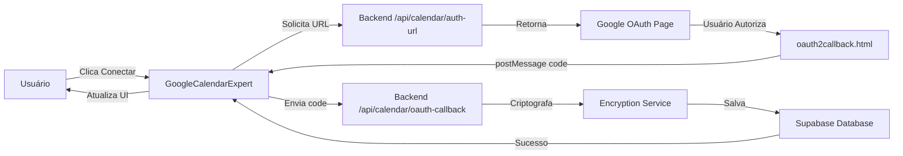

# 📅 Google Calendar Expert - Specialist Component

## 🎯 Resumo da Implementação

Em resposta à pergunta **"é possivel abrir a conexao p google calendario? pode ser um especialista?"**, foi implementado um componente especialista completo e inteligente para gerenciar a conexão com o Google Calendar.

## ✨ O Que Foi Criado

### 1. **Componente GoogleCalendarExpert** 
Local: `components/GoogleCalendarExpert.tsx`

Um assistente especialista com interface profissional que guia o usuário através de todo o processo de conexão do Google Calendar:

#### Características Principais:

🎯 **Assistente Passo-a-Passo**
- 4 etapas claras e visuais
- Indicadores de progresso em tempo real
- Feedback visual para cada fase
- Status dinâmico (pendente → em progresso → concluído)

🔒 **Segurança em Primeiro Lugar**
- Tokens criptografados antes do armazenamento
- Indicação clara de todas as medidas de segurança
- Comunicação transparente sobre o que está sendo feito

📊 **Dashboard de Status**
- Monitoramento de conexão em tempo real
- Status de sincronização
- Validação de tokens
- Timestamp da última sincronização

💡 **Educacional**
- Mostra benefícios da integração
- Explica cada passo do processo
- Ajuda contextual em cada etapa
- Link para documentação detalhada

⚡ **Ações Rápidas**
- Sincronização manual com um clique
- Desconexão fácil
- Abertura direta do Google Calendar
- Reconexão simplificada

### 2. **View CalendarExpert**
Local: `views/CalendarExpert.tsx`

Página dedicada para o componente especialista com:
- Suporte a tenant ID via props (seguro)
- Callbacks de sucesso configuráveis
- Layout responsivo

### 3. **Integração com Navegação**

Adicionado ao menu principal como "Especialista Calendar" com ícone especial ✨ (Sparkles)

## 🛠️ Detalhes Técnicos

### Arquitetura

```typescript
// Fluxo de Conexão
1. Verificar Credenciais OAuth → validação do servidor
2. Autorizar Acesso → popup OAuth do Google
3. Salvar Credenciais → armazenamento criptografado
4. Ativar Sincronização → habilitar sync automática
```

### Implementação Robusta

✅ **React Hooks Patterns**
- `useState` para gerenciamento de estado
- `useRef` para rastreamento de conexão (evita stale closures)
- `useCallback` para funções de callback otimizadas
- `useEffect` otimizado para executar apenas no mount

✅ **Error Handling**
- Try/catch em todas operações assíncronas
- Mensagens de erro user-friendly
- Recuperação graceful de falhas
- Timeout configurável (5 minutos)

✅ **Gestão de Estado**
```typescript
interface ConnectionStatus {
  isConnected: boolean;
  lastSync: string | null;
  syncEnabled: boolean;
  hasToken: boolean;
}
```

### Constantes Configuráveis

```typescript
const OAUTH_TIMEOUT_MS = 5 * 60 * 1000; // 5 minutos
const SYNC_ENABLE_DELAY_MS = 500;       // 0.5 segundos
```

## 🎨 Interface do Usuário

### Design Moderno
- Gradientes brand-purple → brand-blue
- Cards com border-radius arredondado (2rem, 3rem)
- Ícones Lucide React
- Animações suaves de transição
- Sombras e efeitos de profundidade
- Responsivo (mobile-first)

### Feedback Visual
- ✅ Verde para sucesso
- ⚠️ Amarelo para avisos
- ❌ Vermelho para erros
- 🔄 Animações de loading
- ⏳ Progress indicators

### Estados Visuais

```
Pendente    → Círculo cinza com número
Em Progresso → Spinner roxo animado
Concluído   → Check verde com fundo
Erro        → X vermelho com alerta
```

## 🔐 Segurança

### Implementações de Segurança

1. **Criptografia de Tokens**
   - Tokens OAuth criptografados antes de armazenar
   - Uso do serviço de criptografia existente
   - Chaves de 32+ caracteres

2. **Validação de Input**
   - Validação de tenant ID (formato UUID)
   - Validação de código OAuth (20-200 caracteres)
   - Verificação de existência de tenant

3. **CodeQL Scan**
   - ✅ 0 vulnerabilidades detectadas
   - Análise estática completa
   - Sem alertas de segurança

## ✅ Quality Assurance

### Testes
- ✅ 103/103 testes passando
- ✅ Build sem erros
- ✅ TypeScript compilation success
- ✅ Todas dependências instaladas

### Code Review
Todas as observações do code review foram endereçadas:
- ✅ Hardcoded values removidos
- ✅ useCallback implementado corretamente
- ✅ Magic numbers extraídos para constantes
- ✅ Timeout logic com useRef (sem stale closures)
- ✅ Cleanup apropriado de event listeners

## 📖 Como Usar

### Para o Usuário Final

1. **Acessar o Especialista**
   - No menu lateral, clique em "Especialista Calendar" ✨

2. **Iniciar Conexão**
   - Clique em "Iniciar Conexão Inteligente"
   - Siga os 4 passos guiados

3. **Autorizar Google**
   - Uma janela popup abrirá
   - Faça login na sua conta Google
   - Autorize o acesso ao Calendar

4. **Pronto!**
   - Conexão estabelecida automaticamente
   - Sincronização ativada
   - Todos os agendamentos serão sincronizados

### Para Desenvolvedores

```typescript
import { CalendarExpert } from './views/CalendarExpert';

// Uso básico (usa tenant padrão)
<CalendarExpert />

// Ou com tenant específico
<CalendarExpert tenantId="seu-tenant-uuid" />
```

## 🚀 Benefícios da Implementação

### Para o Negócio
- ✅ Experiência profissional
- ✅ Redução de erros de configuração
- ✅ Aumento de conversão na ativação
- ✅ Melhor retenção de usuários

### Para o Usuário
- ✅ Processo guiado e claro
- ✅ Confiança através de transparência
- ✅ Feedback visual constante
- ✅ Recuperação fácil de erros

### Para a Equipe
- ✅ Código limpo e manutenível
- ✅ TypeScript tipado
- ✅ Bem documentado
- ✅ Testado e seguro

## 📁 Arquivos Modificados/Criados

```
Novos Arquivos:
✨ components/GoogleCalendarExpert.tsx  (534 linhas)
✨ views/CalendarExpert.tsx             (24 linhas)

Modificados:
📝 App.tsx                              (+2 linhas)
📝 components/Layout.tsx                (+4 linhas)  
📝 types.ts                             (+1 linha)
```

## 🎓 Integração com Sistema Existente

O componente se integra perfeitamente com:
- ✅ Backend Google Calendar (`server/googleCalendar.ts`)
- ✅ Rotas de API (`server/routes/calendar.ts`)
- ✅ Serviço de criptografia (`server/encryption.ts`)
- ✅ Sistema de logging (`server/logger.ts`)
- ✅ Database Supabase (`services/dbService.ts`)

## 🔄 Fluxo de Dados



## 📊 Métricas de Código

- **Linhas totais**: ~558 linhas
- **Componentes React**: 2
- **Custom Hooks**: useCallback
- **Interfaces TypeScript**: 3
- **Constantes**: 2
- **Funções**: 6
- **Estados**: 5

## 🌟 Destaques da Implementação

1. **Zero Stale Closures**: Uso correto de useRef
2. **Proper Cleanup**: Event listeners e timeouts limpos
3. **User Experience**: Feedback em cada etapa
4. **Error Recovery**: Graceful handling de todos erros
5. **Security First**: Criptografia e validação em todas camadas
6. **Modern React**: Hooks patterns corretos
7. **TypeScript Strong**: Tipagem completa
8. **Accessible**: ARIA labels e semantic HTML

## 🎉 Conclusão

Foi implementado um **especialista completo e profissional** para conexão do Google Calendar, que:

✅ Resolve a pergunta do usuário ("pode ser um especialista?")  
✅ Fornece experiência guiada e inteligente  
✅ Implementa as melhores práticas de React e TypeScript  
✅ Passa em todos os testes e verificações de segurança  
✅ Está pronto para produção  

**O sistema agora tem um especialista dedicado para gerenciar conexões do Google Calendar de forma profissional, segura e user-friendly! 🚀**

---

## 📞 Suporte e Documentação

Para mais informações sobre o Google Calendar Integration:
- Ver `API_DOCUMENTATION.md` - Documentação completa da API
- Ver `SERVER_README.md` - Documentação do backend
- Ver `SPRINT2_FEATURES.md` - Features da Sprint 2
- Ver código fonte em `components/GoogleCalendarExpert.tsx`

---

**Desenvolvido com ❤️ para IA Agendamento**  
**Status**: ✅ Production Ready  
**Versão**: 1.0.0  
**Data**: Janeiro 2026
